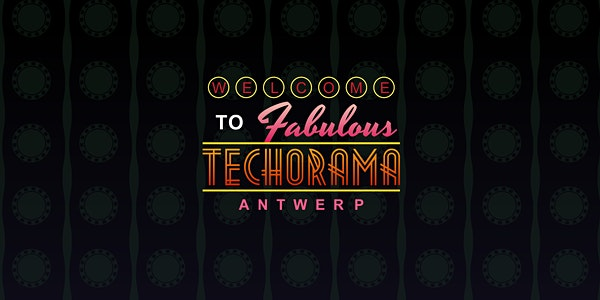
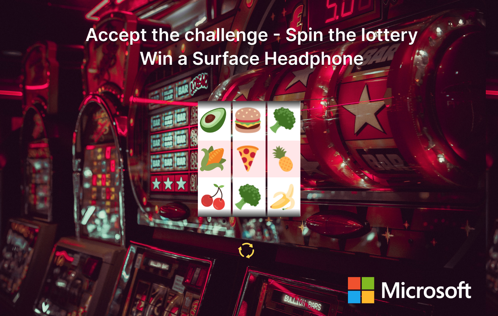

# Microsoft @ Techorama 2022

Welcome to the Microsoft booth @ Techorama 2022. Are you ready to play a game, and win a cool price? Challenge yourself and beat the lottery machine!

## How it works

With this challenge you will be presented a coding challenge. After solving the coding challenge, we will verify if your solution is correct against a CI/CD pipeline in Azure DevOps. Once the build succeeds, you are invited the trigger the lottery machine. If you hit the 3 same symbols, BOOOOM!, you win a super cool Surface headphone or free Microsoft examn voucher.

## 1. Throw the dice

Before you can get started hacking the challenge, you first need to throw the dice. The resulting eyes will tell you which challenge (1-6) you need to solve.

## 2. Open the exercise

Clone the repository, and make a pull request.

