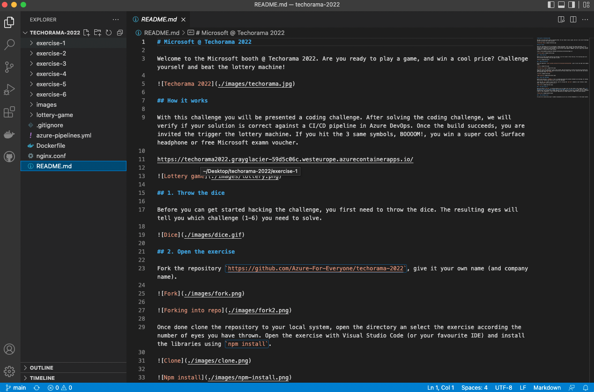
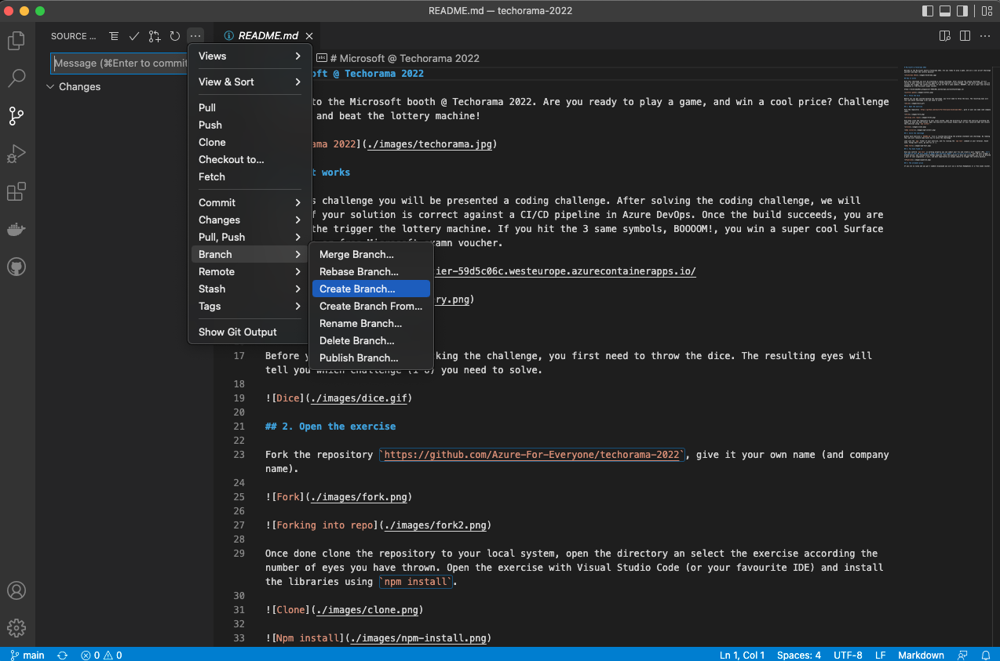
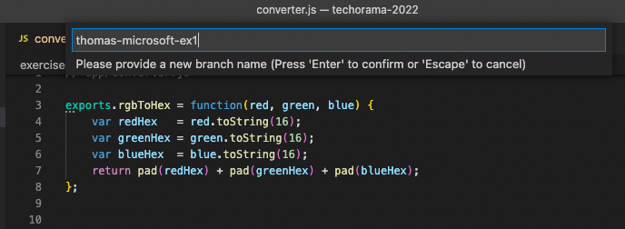
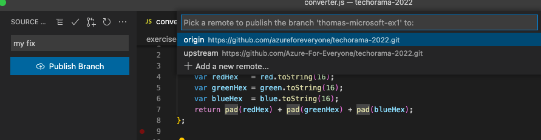
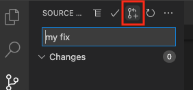
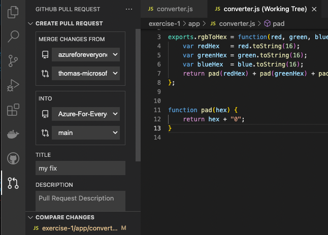
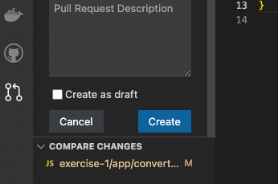
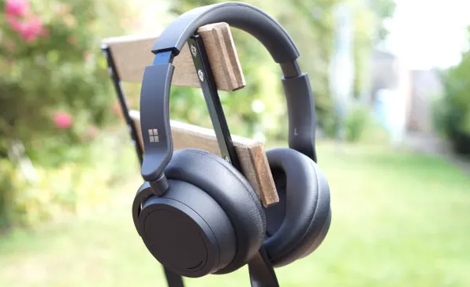

# Microsoft @ Techorama 2022

Welcome to the Microsoft booth @ Techorama 2022. Are you ready to play a game, and win a cool price? Challenge yourself and beat the lottery machine!

## How it works

With this challenge you will be presented a coding challenge. After solving the coding challenge, we will verify if your solution is correct against a CI/CD pipeline in Azure DevOps. Once the build succeeds, you are invited the trigger the lottery machine. If you hit the 3 same symbols, BOOOOM!, you win a super cool Surface headphone or free Microsoft examn voucher.

https://techorama2022.grayglacier-59d5c06c.westeurope.azurecontainerapps.io/

## 1. Throw the dice

Before you can get started hacking the challenge, you first need to throw the dice. The resulting eyes will tell you which challenge (1-6) you need to solve.

## 2. Open the exercise

Open the Visual Studio Code editor and create a new branch.

You will need to give the branch a proper name. Please choose your **firstname** and *company name** and **!!VERY IMPORTANT!!** add a suffix **-ex1**, **-ex2**, **-ex3**, **-ex4**, **-ex5** or **-ex6** depending the exercise you are going to solve. If you don't do this, Azure DevOps will not be able to validate your solution.

## 3. Solve the challenge

Within each exercise a `README.md` file is located describing the problem statement and challenge. By reading this you will receive some hints how to solve the challenge.

Look into the `app` folder of your exercise, and try running the `npm test` command in your terminal. Ooooh oooh, things don't work, go and fix it ;).

## 4. You have fixed it

Once you confirm `npm test` is working properly you can commit your fix. First commit your changes into your branch and publish it. Make sure to use the right remote (first one).

Once published, and comitted our fix, we can go ahead an make a pull request (PR) to the remote branch. Select the PR icon on the top.

Specify a title for the PR and press the create button at the bottom.

 So what happens now? Your PR will trigger a Github action, and related Azure DevOps pipeline. Once the pipeline is done and succeeded, you will be granted a pair of cool sunglasses, a coin, and most importantly an unique chance to trigger the lottery machine.

Your resulting pipeline will be shown infront of you.

## 5. The ultimate price

If you are so lucky and you got 3 symbols displayed you will win a Surface Headphones or a free examn voucher.

