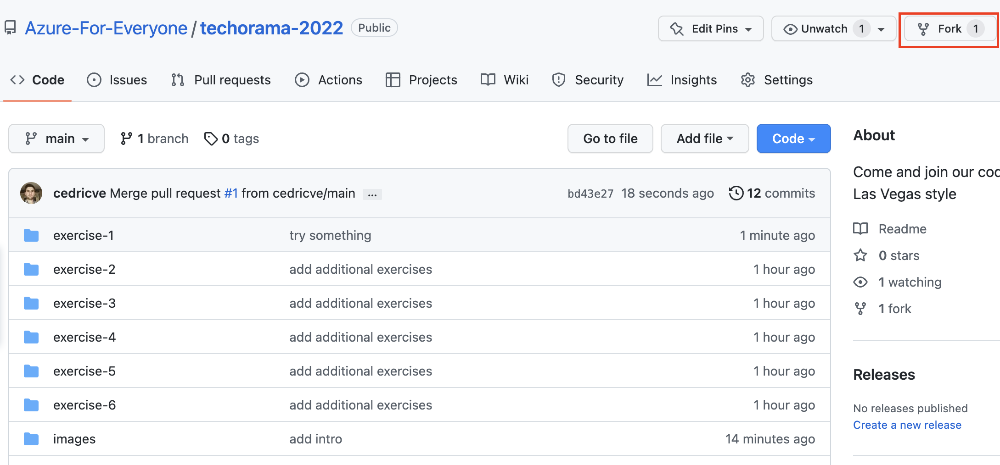
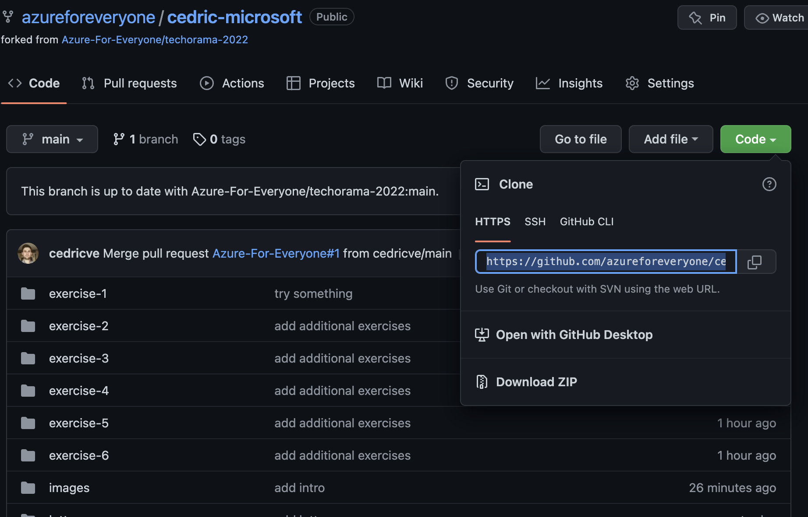
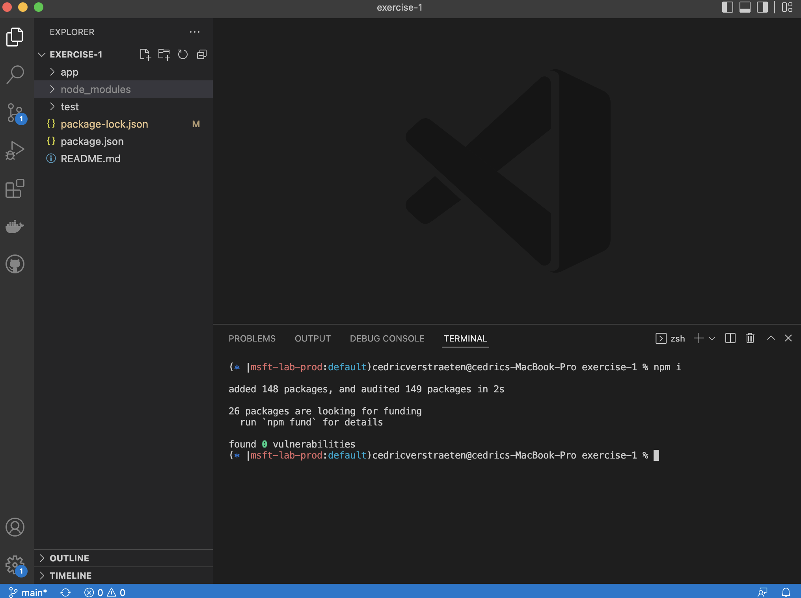
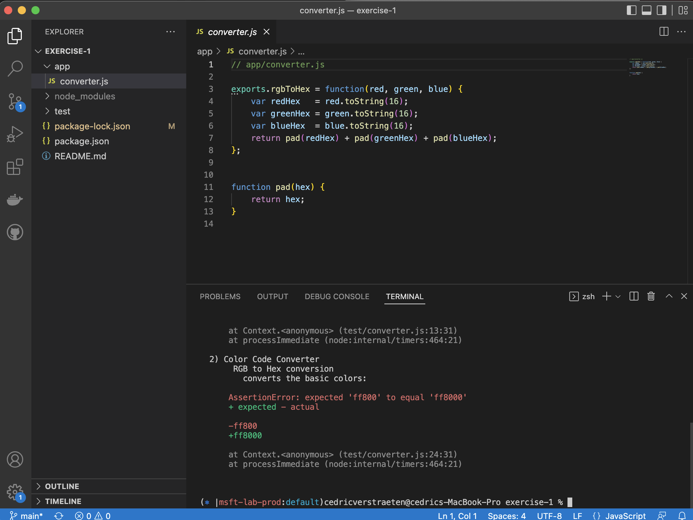
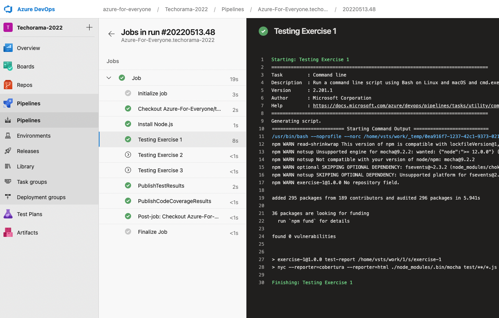

# Microsoft @ Techorama 2022

Welcome to the Microsoft booth @ Techorama 2022. Are you ready to play a game, and win a cool price? Challenge yourself and beat the lottery machine!

## How it works

With this challenge you will be presented a coding challenge. After solving the coding challenge, we will verify if your solution is correct against a CI/CD pipeline in Azure DevOps. Once the build succeeds, you are invited the trigger the lottery machine. If you hit the 3 same symbols, BOOOOM!, you win a super cool Surface headphone or free Microsoft examn voucher.

https://techorama2022.grayglacier-59d5c06c.westeurope.azurecontainerapps.io/

## 1. Throw the dice

Before you can get started hacking the challenge, you first need to throw the dice. The resulting eyes will tell you which challenge (1-6) you need to solve.

## 2. Open the exercise

Fork the repository `https://github.com/Azure-For-Everyone/techorama-2022`, give it your own name (and company name).

Once done clone the repository to your local system, open the directory an select the exercise according the number of eyes you have thrown. Open the exercise with Visual Studio Code (or your favourite IDE) and install the libraries using `npm install`.

## 3. Solve the challenge

Within each exercise a `README.md` file is located describing the problem statement and challenge. By reading this you will receive some hints how to solve the challenge.

Look into the `app` folder of your exercise, and try running the `npm test` command in your terminal. Ooooh oooh, things don't work, go and fix it ;).

## 4. You have fixed it

Once you confirm `npm test` is working properly you can commit your fix and create a pull request (PR). **!!! The name of your PR will needs to equal your exercise number: so 1,2,3,4,5 or 6 !!!**. Your PR will trigger a Github action, and related Azure DevOps pipeline. Once the pipeline is done and succeeded, you will be granted a pair of cool sunglasses, a coin, and most importantly an unique chance to trigger the lottery machine.

## 5. The ultimate price

If you are so lucky and you got 3 symbols displayed you will win a Surface Headphones or a free examn voucher.

