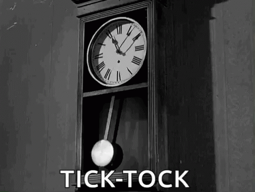

# Exercise 2

Every second counts in a human life. We need to spend time with our family and friends, be highly productive and efficient in our professional lifes. The older you are, the more you start valueing time, and you start to understand that every second counts. But hey how many seconds old are you?

# The challenge

Within this project `app` folder you will find a `age.js`. In this file you will find a `ageToSeconds` function that is responsible for transforming an age in years to seconds. Try running the `npm test` command in the terminal to see if the converter is working as expected.

# The problem

As you might have noticed, something is not working, and that is REALLY annoying. I bet something is going wrong in the `ageToSeconds` function, but not sure ;). Can you help solving this issue?