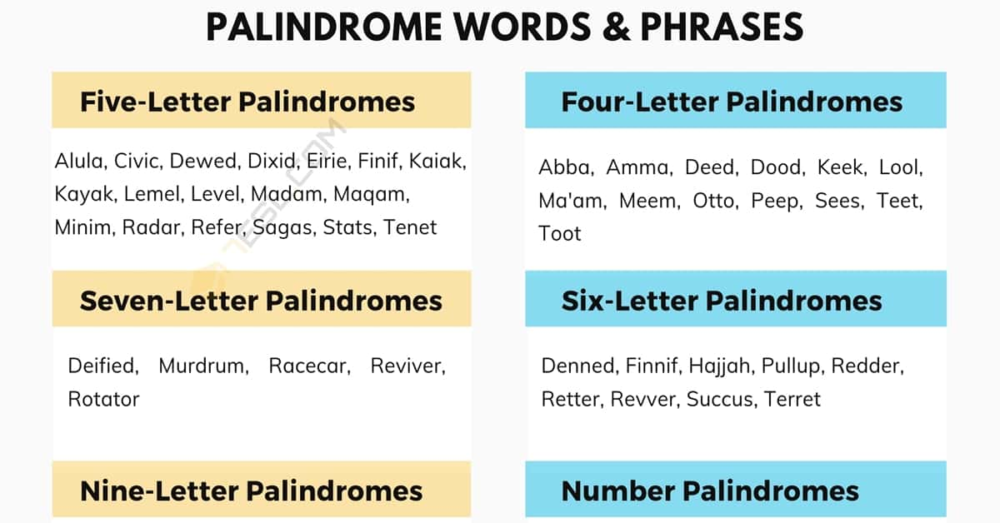

# Exercise 5

Everyone loves a palindrome right, we use it everyday. Hmm? Not really, but to be honest some of them are cool like this one. This year we had this special data **22/02/2022** (22th of february in 2022). Nice palemdroom isn't it? 

Of course more palindromes like:

- Madam
- Racecar
- Level
- and much more.

Palindromes are everywhere, but can we develop a function that calculates a palindrome? Yes I believe so.

# The challenge

Within this project `app` folder you will find a `palindrome.js`. In this file you will find a function: `isPalindrome`. This function will validate if a word is a valid palimdrone. Try running the `npm test` command in the terminal to see if the converter is working as expected.

# The problem

As you might have noticed, something is not working, and that is REALLY annoying. I bet something is going wrong in the `isPalindrome` function, but not sure ;). Can you help solving this issue?