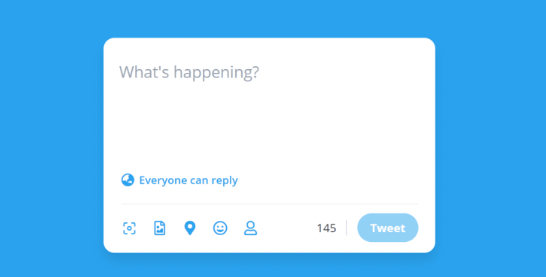

# Exercise 6

Spreading messages over the internet, using social media, is part of our daily lifes. It's all because we think communication and sharing knowledge is key, and it helps us becoming a better version of ourselves. We can all write books describing our past experiences and our future ideas, but unfortunately we have to be brief and pick the right words and sentences when communicating. 

If we look at Twitter, they took this really serious. When writing a Twitter post you can only write messages of 280 characters long (and before even less). This idea made Twitter successfull, but also improved us as communicators. Using less words and even make more impact. Having this limitation of 280 characters could make us better communicators, so wouldn't it be cool if we have this function that can warn us when we are to verbose is our communication? Let's have a look!

# The challenge

Within this project `app` folder you will find a `message.js`. In this file you will find a `countCharacters` function that will verify if your post is a valid Twitter post, and more precisely if it isn't too long. Try running the `npm test` command in the terminal to see if the converter is working as expected.

# The problem

As you might have noticed, something is not working, and that is REALLY annoying. Something is going wrong in this `countCharacters` function ;). Can you help solving this issue?